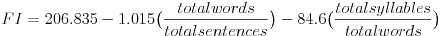
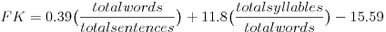

# Results
The result were simple to get once the sentence, word, and syllable numbers were gathered.
Getting those numbers though can be much more complex than the assignment pointed out.  I found that syllable count in the english language mainly rely on phonemes, which then can very base on region and what not.
I stumbled upon a very detailed answer to a post on [Stack Exchange](http://stackoverflow.com/a/9096723) which set me going on a dissertation of hyphenation from 1983.  After which, I realized I would have to have to spend a rather long time to implement these designs.
Breaking a word out of a sentence wasn't to much a hassle, as once the sentence was found, word boundaries were easy to find.
There was one issue though, the files from [Project Gutenberg](https://www.gutenberg.org/) were UTF-8 encoded, which means — for C++ — that some characters are not recognized in the normal text processing.
Several libraries can be used to do text encoding, but these required higher overhead code wise.

I was able to find a [website](https://readability-score.com/text/ "Measure Text Readability")(MTR) that also could calculate the values, though it was slow, and only allowed so many per IP.
These values can be found in Table 1 under the row *MTR-FK*.
If you already notice, I didn't immediately see MTR having just the Flesch Index, so I decided to calculate the Flesch-Kincaid Grade Level to have a comparison to MTR.

Code wise, this application was done in *C++* in the standard *C++11* with a *GCC* compiler that supported *C++11*.
This application also relied upon *CMake* to create the build system and *Make* compile the generated files.

The code was broken down rather simply, a class `Flesch_Index` was used within the namespace `fi`.
Functionaly, this creates a the object `Flesch_Index`, with the *filename* to read in.  Once this is initialized, `Read` is called, then `Analyze`.
`Read` just reads the file in and breaks the text into *sentences* and *words*.
`Analyze` calls the methods that break the *words* into *syllables* using two rules.

A sentence was broken down with this rule:
1. A sentence ends if characters *?*, *!*, and *.* were found.

A word was broken down with these rules:
1. A word ends if whitespace is found.
2. Strip the word of all non-alphanumeric.
3. Lowercase the entire word.

Note: An em dash, '—', could separate a word, but this application will count the two words as one.
This is the issue talked about with encoding above.

A vowel was broken down with these rules:
1. A vowel at the start of a word or
2. A vowel following a consonant in a word
  * One exception to Rule 2: A lone *e* at the end of a word does not count as a syllable.

From the comparisons with MTR, I can definitely say that I got something different.
I also didn't realize that I can get the statistical break down of sentences, words, and syllables until I already used all of my queries.
If I would have it would have allowed me to see better where we differed.
I used Flesch reading-was test and Flesch–Kincaid grade level to calculate the reading levels.  The second one so that I could compare to the MTR results.

1. 

2. 

These equations were fairly straight forward to implement, and difference between my calculations and MTR are most likely the result of values *syllables*, *words*, and *sentences* differing.

Bar graph 1 and 2 show a fair relationship between the *sentence*, *word*, and *syllable* counts.

Line graph 1 shows the various files resulting Flesch reading-ease test score — the higher the score, the easier to read.
Line graph 2 shows the Flesch-Kincaid Grade Level that I calculated compared with the calculation from MTR.  The higher the score here is harder to read.

I found it interesting in Line graph 1 that Gettysburg Address is ranked so highly.
Also, Line graph 2 shows my calculation and MTR's calculation crossing briefly in `NYTimes.txt`, where in the other values I have been having a much higher value.

This project was fairly straight forward, and because of the extra reading it lead me too, I would say I learned much from this.
I focused early on learning *CMake* build structures, as I felt that this would be a good opportunity to get to know it.
Because of the extra readings into hyphenation and syllables, I would be interested to see if there is something to be looked into for a more simplified library for syllables in *C++*.

#### Table 1

| File        | [Gettysburg Address](../data/GettysburgAddress.txt) |	[Moby Dick](../data/MobyDick.txt) | [NY Times](../data/NYTimes.txt) | [The Republic](TheRepublic.txt) |
| :---------: | :-------------------: | :----------: | :---------: | :-------------: |
| **Syllables**   | 333 | 257100 | 1041 | 265674 |
| **Words** | 274 | 208742 | 808 | 219368 |
| **Sentences** | 21 | 10120 | 55 | 9225 |
| **FI** | 90.7749 | 81.7001 | 82.9279 | 80.2405 |
| **FK** | 6.3377 | 9.10077 |6.11673 | 10.5733|
| **MTR-FK** | 3.9 | 4.2 | 8.1 | 4.9 |

#### Bar Graph 1
![File Break Down Large][fbdl]

#### Bar Graph 2
![File Break Down Small][fbds]

####  Line Graph 1
![Flesch Index][fi]

####  Line Graph 2
![Flesch-Kincaid Grade Level][fkgl]

[fbdl]: FBDL.png "File Break Down Large"

[fbds]: FBDS.png "File Break Down Small"

[fi]: ./FI.png "Flesch Index"

[fkgl]: FKGL.png "Flesch-Kincaid Grade Level"
